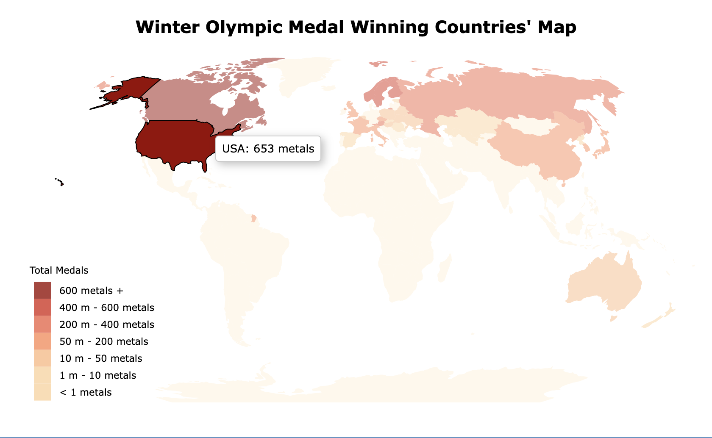
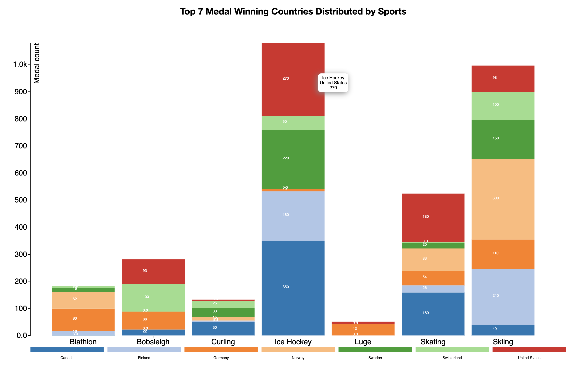

## Winter Olympics Above the Tropic of Cancer

### Set up instruction
-------------------
1. Download **exercise1** directory
2. Copy directory **/exercise1** to d3js working directory, for example: if working dir is **./d3js-tutorial/slides/D3_tutorial/Example_Files/**, then the correct path is: **./d3js-tutorial/slides/D3_tutorial/Example_Files/exercise1**
3. Direct to **/working_directory/exercise1**
4. Run ```python -m http.server 8080``` within working dir
5. Open local browser with http://localhost:8080
6. Visualization link:
- Choropleth Map: http://localhost:8080/<working_dir>/exercise1/html/map.html
- Bar chart: http://localhost:8080/<working_dir>/exercise1/html/barchart.html
<br></br>

### Medal Winning Countries' Choropleth Map
-------------------
http://localhost:8080/<working_dir>/exercise1/html/map.html



### Top 7 Winning Countries by Sports Type
-------------------
http://localhost:8080/<working_dir>/exercise1/html/barchart.html


